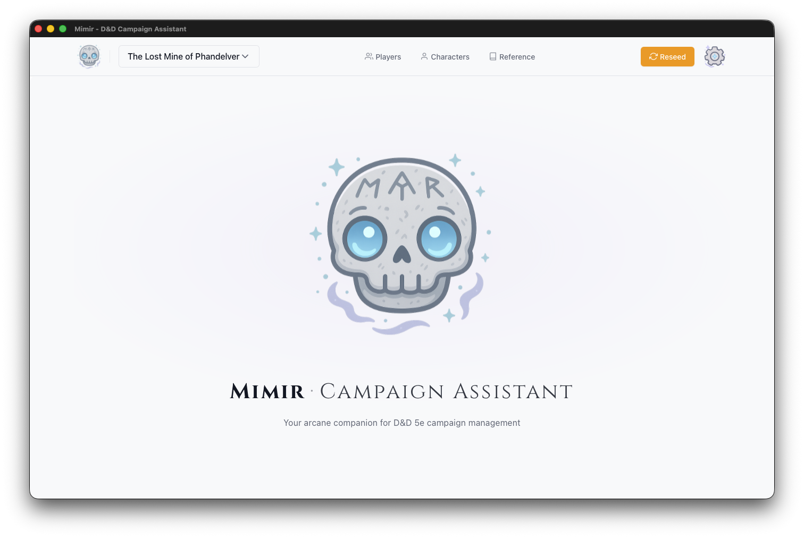

# Create a Campaign

This guide shows you how to create a new campaign in Mimir and configure it for your game.

## Steps

1. **Open the Campaign Selector** in the header bar
2. Click **+ New Campaign**
3. Fill in the campaign details:
   - **Campaign Name** (required) — A descriptive name for your campaign
   - **Description** (optional) — Notes about your campaign concept, themes, or setting
4. Click **Create Campaign**

You'll be redirected to your new campaign's dashboard.

## What Gets Created

When you create a campaign, Mimir automatically generates **11 template documents** to give you a starting structure — Campaign Pitch, World Primer, Character Guidelines, Safety Tools, House Rules, and more. These appear in the Campaign tab of your dashboard. Edit or delete them as needed — they're a starting point, not a requirement.

## Configure Campaign Sources

After creating your campaign, you'll likely want to configure which D&D source books are available:

1. Click the **Sources** button in the dashboard header
2. Enable the books your group owns or you want to use
3. Close the modal

Source filtering affects all catalog searches within this campaign — monster searches, spell lists in character creation, item lookups, and more. A "PHB only" campaign won't show Xanathar's Guide content.

## Tips

- Use descriptive names that help you identify campaigns later (e.g., "Curse of Strahd - Tuesday Group" rather than just "Campaign 1")
- The description is only visible to you — use it for notes about themes, players, or campaign status
- Configure sources early — it controls what content appears throughout the campaign
- You can archive campaigns you're no longer running to keep your list clean

## See Also

- [Tutorial: Your First Campaign](../../tutorials/01-first-campaign.md)
- [Manage Documents](./manage-documents.md)
- [Export Campaign](./export-campaign.md)
- [Campaigns vs Modules](../../explanation/campaign-vs-module.md) — Understanding the hierarchy
