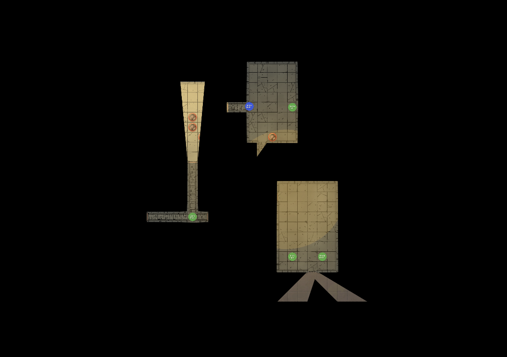

# Fog of War

Recipes for controlling what players see on the battle map. All controls live in the map toolbar of the DM Map window, and changes take effect on the Player Display immediately.

- Control-by-control reference: [Play Mode](../../reference/ui/play-mode.md)
- Rules and numbers (vision ranges, light radii): [Vision & Lighting](../../reference/vision-and-lighting.md)
- How and why the system works: [Vision System](../../explanation/vision-system.md)

> **Note:** The vision controls (**Fog**, **LOS**, ambient light, debug overlays) only appear for maps with UVTT wall data. On plain image maps, work with **Reveal Map** and per-token visibility instead.

## Hide the map during exploration

Use this when the party enters an unexplored area and should only see what their characters can see.

1. Open the Player Display.
2. In the map toolbar, click **Fog**.
3. Check the DM view: areas players cannot see are shaded semi-transparently for you and hidden entirely from players.

While Fog is on, **LOS** is forced on as well — tokens outside the party's line of sight are hidden automatically. You cannot turn LOS off without first turning Fog off.

## Reveal areas as the party explores

There is no manual reveal brush — the revealed area is computed live from PC token vision. To reveal more of the map:

1. Drag PC tokens forward. Vision follows each token.
2. Click a door on the map to open it. Open doors let vision pass; closed doors block it.
3. Add or activate light sources where ambient light is dim or dark — see [Manage Light Sources](../maps/manage-light-sources.md).
4. If a whole area should become visible, raise the ambient light level to **Bright**.

Moving a token back also retracts its vision: fog is recalculated from current token positions, not accumulated.

## Hide enemies but show terrain

Use this for encounters where players know the layout but should not see unseen threats.

1. Make sure **Fog** is off.
2. Click **LOS** in the map toolbar.

The map stays fully visible; tokens outside the party's line of sight are hidden until a PC can see them.

## Reveal the whole map temporarily

Use this for town maps, overviews, or any scene where fog doesn't fit the fiction.

1. Click the **Reveal Map** (eye) button in the toolbar.
2. When you want fog back, click it again — the tooltip changes to "Hide map (restore fog)".

Reveal Map overrides Fog and LOS (both buttons are disabled while it is active) but does not change their settings, so switching it off restores exactly the state you had before. Tokens you have individually hidden stay hidden.

## Hide a lurking enemy regardless of vision

1. Right-click the token and choose **Hide from Players** (or select the token and press **H**).
2. The token is hidden from the Player Display even where players have vision, and even while Reveal Map is active.

## Set the mood with ambient light

1. Pick **Bright**, **Dim**, or **Dark** from the ambient light dropdown.
2. In Dark, only darkvision and light sources grant vision — combine with sparse, placed torches for room-by-room tension.

The dropdown starts at the map's UVTT ambient light value (if any); your selection overrides it for the session.

## Stage a dramatic reveal

1. Click **Blackout** in the header (available while the Player Display is open) so players see nothing.
2. Position tokens, toggle lights, and set the ambient light.
3. Turn Blackout off to present the finished scene.

## Check what players can actually see

1. Toggle the debug overlays button in the toolbar to draw vision ranges and walls on the DM view.
2. For ground truth, glance at the Player Display window itself.

## See Also

- [Use Player Display](./use-player-display.md)
- [Manage Light Sources](../maps/manage-light-sources.md)
- [Vision & Lighting Reference](../../reference/vision-and-lighting.md)
- [Vision System](../../explanation/vision-system.md)
