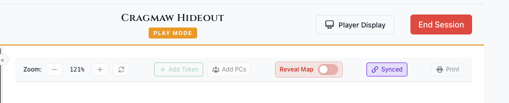

# Use Player Display

Show players a fog-of-war view on a second screen.

## Opening the Display

1. Click **Play** on a module to open the DM Map window
2. Click **Display** in the window's top toolbar (it changes to **Display On**)
3. A new window opens
4. Drag the window to your player-facing screen

## What Players See

The player display shows:
- Current map with fog of war
- Visible tokens only
- No monster names or stats
- Clean interface without controls

## Blackout Mode

Hide everything from players:
1. Click the **Blackout** button (crossed-out-eye icon, tooltip "Toggle Blackout") next to **Display On** — it appears while the display is open
2. Player screen blacks out and shows "Display Paused"
3. Click again to restore

Use for:
- Setup before session
- Dramatic reveals
- Map transitions
- Bathroom breaks

## Switching Maps

1. Pick a different map from the **Map** dropdown at the top left of the DM Map window
2. Player display updates automatically
3. Use Blackout during transitions for drama

## Closing the Display

- Click the **Display On** button again, or
- Close the window directly

## Tips

- Use fullscreen (F11) on the player screen
- Keep notes on your screen, map on theirs
- Use Blackout liberally for reveals

## See Also

- [Fog of War](./fog-of-war.md)
- [Tutorial: Player Display Setup](../../tutorials/04-player-display.md)
