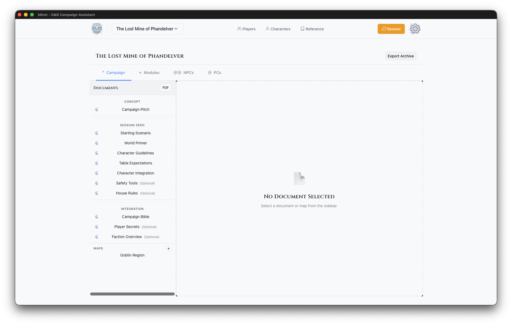

# Campaign Dashboard

The Campaign Dashboard is your central hub for managing a campaign. It uses a tabbed interface to organize different aspects of your campaign.

## Header

- **Campaign Name** — Displayed prominently at the top
- **Sources** — Configure which D&D source books are enabled for this campaign
- **PDF** — Export campaign documents as PDF
- **Export Archive** — Export campaign as `.mimir-campaign.tar.gz` archive

## Tabs

### Campaign Tab

The world-building hub with a two-panel layout:

**Sidebar (Left):**
- **Documents** — Campaign-level documents for lore, setting notes, factions, and world-building. Create new documents with the + button. Reorder with up/down arrows.
- **Maps** — Campaign-level maps (not tied to a specific module). Upload with the + button.

**Main Panel (Right):**
- Opens the document editor when a document is selected
- Shows a map preview when a map is selected
- Maps can be exported to PDF or deleted from the preview

### Modules Tab

Adventure modules within this campaign:

- **Module List** — Table showing all modules with action buttons
- **Play** — Enter Play Mode for a module
- **Open** — Open the module prep view
- **PDF** — Export module materials
- **Create Module** — Add new adventure modules with the + button

### NPCs Tab

Non-player characters for this campaign:

- **NPC List** — All NPCs across modules
- **NPC Details** — Stats, notes, role, location, faction
- **Create NPC** — Add new NPCs

### PCs Tab

Player characters assigned to this campaign:

- **PC List** — Characters in this campaign
- **Add Existing** — Assign existing characters to the campaign
- **PC Details** — Full character sheets with tabs for stats, equipment, spells, and details

### Homebrew Tab

Custom content for this campaign:

- **Items** — Create or clone items from the catalog
- **Monsters** — Clone and modify monsters from the catalog
- **Spells** — Clone and modify spells from the catalog

See [Homebrew Content](../../how-to/homebrew/) for detailed guides.

## See Also

- [Module Prep View](./module-prep-view.md)
- [Manage Documents](../../how-to/campaigns/manage-documents.md)
