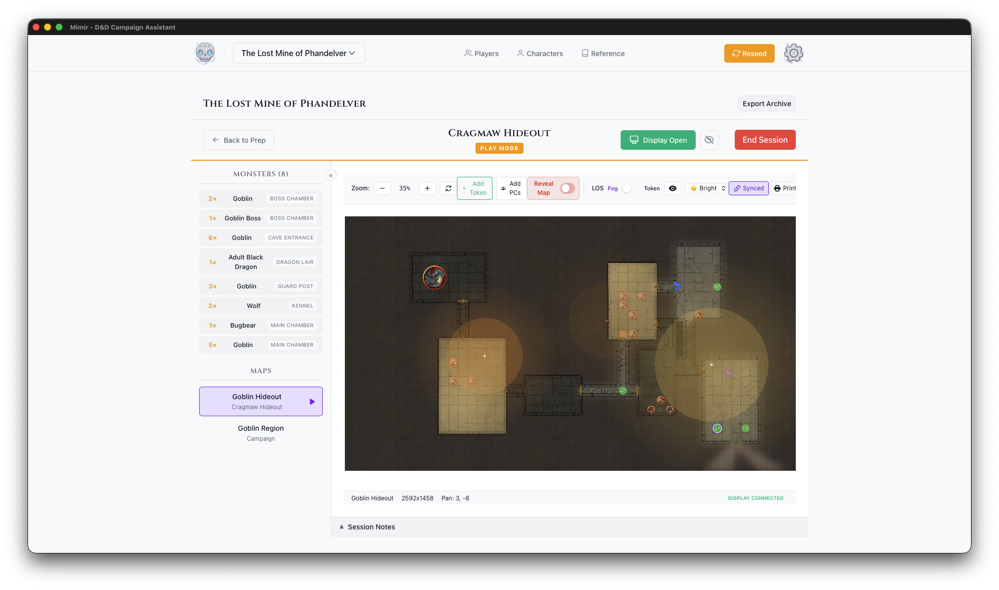

# Play Mode

Play Mode is the interface for running game sessions. It provides tactical map display, monster reference, and session tools.

## Entering Play Mode

Select a module from the Modules tab, then click the **Play** button in the module header.

## Layout

### Header Bar

- **Back to Prep** - Return to Module Prep View
- **Module Name** - Currently playing module
- **PLAY MODE** - Visual indicator
- **Player Display** - Open/close player window
- **Blackout** - Hide content from players (when display open)
- **End Session** - Exit Play Mode

### Sidebar (Left)

Collapsible panel with:

**Monsters**
- All monsters in the module
- Grouped by encounter
- Shows quantity (e.g., "3× Goblin")
- Click for stat block

**Maps**
- All maps in the module
- Click to switch active map
- Maps from other modules available

### Map Canvas (Center)

The tactical display:

- Current map with grid
- All tokens (visible and hidden)
- Fog of war visualization
- Light source effects

### Map Toolbar

Above the map canvas:

| Control | Function |
|---------|----------|
| **Zoom** | +/- buttons, percentage display |
| **Reset** | Fit map to view |
| **Add PCs** | Place all campaign PCs on the map |
| **Reveal Map** | Toggle to bypass fog of war |
| **Print** | Export map to PDF |
| **Fog** | Toggle fog of war (hide map outside PC vision) |
| **LOS** | Toggle token line of sight (hide tokens outside PC vision) |
| **Debug** | Toggle debug overlays (vision ranges, walls) |
| **Ambient Light** | Bright, Dim, or Dark |

### Play Notes (Bottom)

Collapsible notes panel:
- Auto-saves as you type
- Persists between sessions
- Track initiative, HP, events

## Vision Modes

**Fog Mode**
- Map hidden outside PC vision
- Reveals as PCs explore
- Maximum immersion

**Token Mode**
- Map fully visible
- Enemy tokens hidden outside vision
- Geography known, enemies hidden

## Working with Tokens

- **Move** - Click and drag
- **Select** - Click token
- **Toggle visibility** - Right-click → Visible/Hidden
- **View stats** - Click monster in sidebar

## Player Display Controls

When Player Display is open:

- **Blackout** - Hide everything from players

## See Also

- [Player Display](./player-display.md)
- [Start a Session](../../how-to/play-mode/start-session.md)
- [Fog of War](../../how-to/play-mode/fog-of-war.md)
