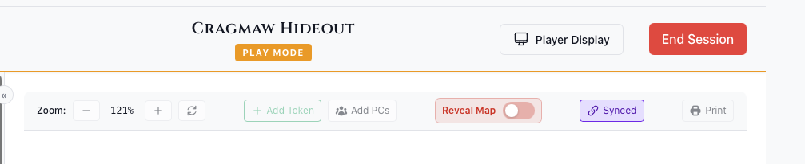
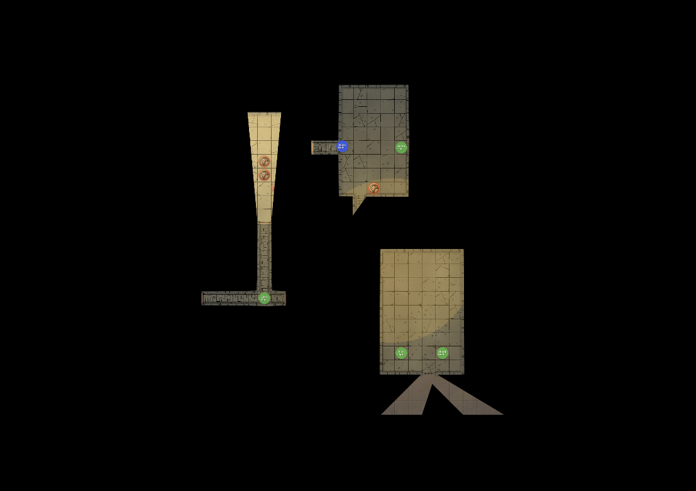
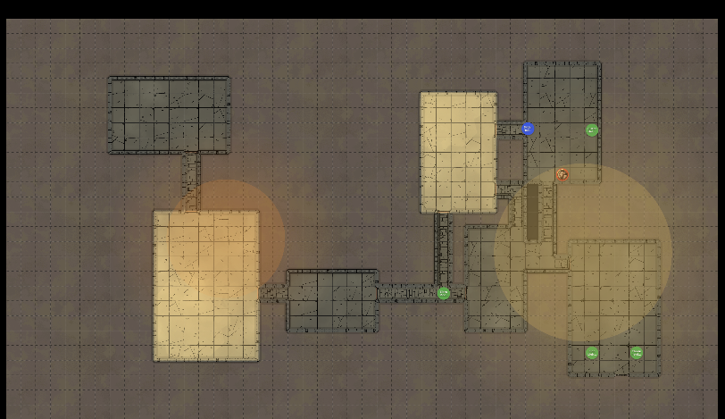

# Player Display

The Player Display is a separate window showing what players can see, designed for a second screen, TV, or projector.

## Opening the Display

In Play Mode, click the **Player Display** button in the header. A new window opens that you can drag to your player-facing screen.

## What Players See

The player display shows:

- **Map** - Current active map
- **Fog of War** - Based on PC positions and vision
- **Visible Tokens** - Only tokens marked as visible
- **Light Effects** - From active light sources

### What's Hidden

Players do NOT see:
- Hidden tokens
- Monster names or stats
- DM controls or UI
- Session notes
- Debug visualizations

## Fog of War Controls

Two independent toggles control what players see:

**Fog**
- Unrevealed areas are black
- Reveals based on PC vision
- Best for exploration

**LOS**
- Map remains fully visible
- Enemy tokens hidden outside PC vision
- Best for tactical combat

## DM Controls

When the Player Display is open, additional controls appear:

| Control | Function |
|---------|----------|
| **Blackout** | Show black screen to players |
| **Reveal Map** | Bypass fog of war entirely |
| **Ambient Light** | Affects fog of war calculation |

## Blackout Mode

Click the eye icon (Blackout) to:
- Hide everything from players
- Show a completely black screen
- Set up encounters secretly
- Create dramatic reveals

Click again to restore the view.

## Physical Setup

### TV/Monitor
- Connect via HDMI/DisplayPort
- Set display to "Extend" (not mirror)
- Drag Player Display window to second screen
- Maximize or fullscreen (F11)

### Projector
- Project onto table or wall
- Useful for tabletop projection mapping

### Virtual/Remote
- Share the Player Display window via screen share
- Works with Discord, Zoom, etc.

## Troubleshooting

| Issue | Solution |
|-------|----------|
| Window on wrong screen | Drag to correct display, then maximize |
| Players see hidden tokens | Check token visibility settings |
| Fog not updating | Verify PCs are marked visible |
| No window opens | Check popup blocker settings |

## See Also

- [Play Mode](./play-mode.md)
- [Use Player Display](../../how-to/play-mode/use-player-display.md)
- [Fog of War](../../how-to/play-mode/fog-of-war.md)
