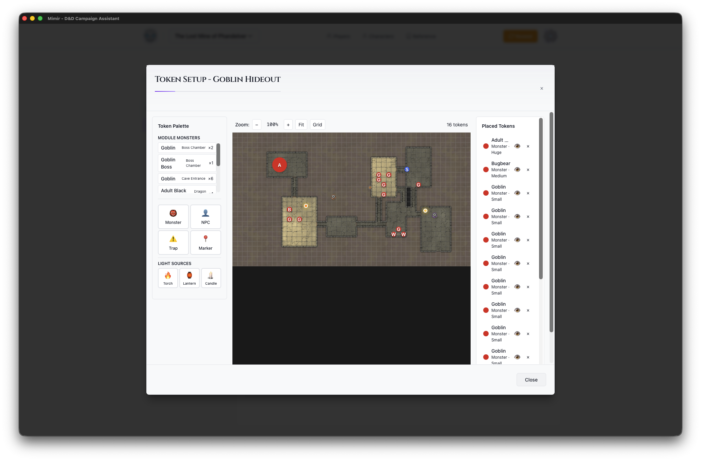

# Token Setup Modal

The Token Setup Modal is where you configure maps, place tokens, and prepare encounters.

## Opening Token Setup

Click the **Place Tokens** button on a map card in the Module Prep View to open Token Setup.

## Layout

### Token Palette (Left)

Tools for adding content to the map:

**Module Monsters** (appears when monsters have been added)
- Quick-select buttons for monsters already in the module
- Shows name, encounter tag, and quantity

**Monster**
- Search D&D 5e monsters by name
- Shows CR and source book
- Click to select, then click map to place

**NPC**
- Add NPC tokens
- Select from module NPCs

**Trap**
- Add trap markers
- Configure trigger areas

**Marker**
- Points of interest
- Landmarks, waypoints, etc.

**Light Sources**
- Torch (20 ft bright / 40 ft dim)
- Lantern (30 ft bright / 60 ft dim)
- Candle (5 ft bright / 10 ft dim)

### Map Canvas (Center)

The main map display:

- **Grid Overlay** - Aligned to map squares
- **Placed Tokens** - All tokens on this map
- **Zoom Controls** - Adjust view
- **Pan** - Click and drag to move

### Placed Tokens (Right)

All placed content:

**Tokens**
- List of all placed tokens
- Click to select on map
- Delete with × button

**Light Sources**
- All placed lights
- Lit/Unlit toggle
- Delete with × button

## Canvas Controls

Located above the map:

- **Zoom** - +/- buttons and percentage
- **Reset** - Fit map to view

## Token Options

When placing tokens:

| Option | Description |
|--------|-------------|
| **Size** | Tiny, Small, Medium, Large, Huge, Gargantuan |
| **Color** | Border color for identification |
| **Visible** | Whether players can see this token |

## Workflow

1. Open Token Setup (click Place Tokens on a map card)
2. Select token type from palette
3. Configure options if needed
4. Click on map to place
5. Repeat for all tokens
6. Add light sources as needed
7. Close modal (×) - saves automatically

## See Also

- [Add Monsters](../../how-to/modules/add-monsters.md)
- [Place Tokens](../../how-to/maps/place-tokens.md)
- [Manage Light Sources](../../how-to/maps/manage-light-sources.md)
