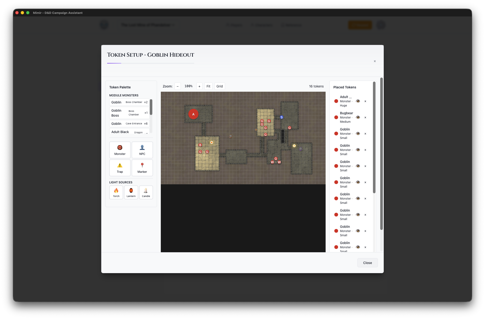

# Token Setup Modal

The Token Setup Modal is where you configure maps, place tokens, and prepare encounters.

## Opening Token Setup

Click the **Place Tokens** button on a map card in the Module Prep View to open Token Setup.

## Layout

### Token Palette (Left)

Tools for adding content to the map:

**Module Monsters** (appears when monsters have been added)
- Quick-select buttons for monsters already in the module
- Shows name, encounter tag, and quantity

**Monster**
- Search D&D 5e monsters by name
- Shows CR and source book
- Click to select, then click map to place

**NPC**
- Add NPC tokens
- Select from module NPCs

**Trap**
- Place trap markers at grid positions
- Optionally link a catalog trap (search by name) — the marker takes the trap's name
- Trap records store name, description, trigger/effect descriptions, detection DC, triggered state, and player visibility

**Marker**
- Place point-of-interest (POI) markers at grid positions
- POI records store name, description, icon, color, and player visibility

**Light Sources**
- Torch (20 ft bright / 40 ft dim)
- Lantern (30 ft bright / 60 ft dim)
- Candle (5 ft bright / 10 ft dim)

### Map Canvas (Center)

The main map display:

- **Grid Overlay** - Aligned to map squares
- **Placed Tokens** - All tokens on this map
- **Trap/POI Markers** - Drag to move; right-click for actions (visibility, trigger/reset for traps, edit for POIs, delete)
- **Zoom Controls** - Adjust view
- **Pan** - Click and drag to move

### Placed Content (Right)

All placed content:

**Tokens**
- List of all placed tokens
- Click to select on map
- Delete with × button

**Light Sources**
- All placed lights
- Lit/Unlit toggle
- Delete with × button

**Traps**
- Shows name, DC (if set), and triggered state
- Vis/Hid toggle for player visibility
- Delete with × button

**Points of Interest**
- Shows name and icon type
- Edit, Vis/Hid toggle, and delete buttons

## Canvas Controls

Located above the map:

- **Zoom** - +/- buttons and percentage
- **Reset** - Fit map to view

## Token Options

When placing tokens:

| Option | Description |
|--------|-------------|
| **Size** | Tiny, Small, Medium, Large, Huge, Gargantuan |
| **Color** | Border color for identification |
| **Visible** | Whether players can see this token |

## See Also

- [Place Tokens](../../how-to/maps/place-tokens.md) — Step-by-step placement workflow
- [Manage Traps and POIs](../../how-to/play-mode/manage-traps-and-pois.md) — Placing and running trap/POI markers
- [Add Monsters](../../how-to/modules/add-monsters.md)
- [Manage Light Sources](../../how-to/maps/manage-light-sources.md)
- [Play Mode](./play-mode.md) — Where placed content is used in session
