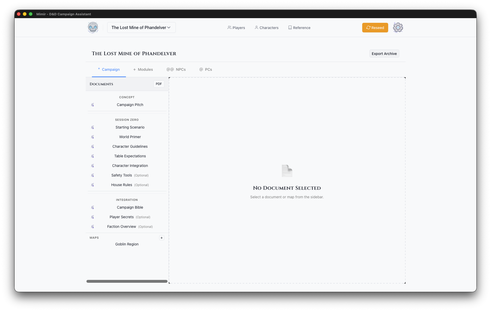

# Your First Campaign

This tutorial walks you through creating your first campaign in Mimir. By the end, you'll have a fully configured campaign ready for adventure modules and session play.

**Time to complete:** 5-10 minutes

**What you'll learn:**
- Navigate the Mimir interface
- Create a new campaign
- Explore the Campaign Dashboard
- Import catalog data for the next tutorials

## Prerequisites

- Mimir installed and running
- No additional setup required

## Step 1: Launch Mimir

When you launch Mimir, you'll see the home screen with the floating Mimir skull and the tagline "Your arcane companion for D&D 5e campaign management."

The header bar contains:
- **Mimir logo** (skull icon) - Click to return home
- **Campaign selector** - Switch between campaigns
- **Characters** - Create and manage PCs and NPCs
- **Reference** - Open the D&D 5e reference library
- **Settings** (gear icon) - Configure application preferences

## Step 2: Create a New Campaign

1. Click the **Campaign Selector** dropdown in the header
2. Click **Create New Campaign**

The **Create New Campaign** form opens.

## Step 3: Fill in Campaign Details

The campaign creation form has two fields:

### Campaign Name (Required)
Enter a descriptive name for your campaign. This appears throughout Mimir and in exported materials.

**Example:** "Curse of Strahd", "Homebrew - The Shattered Realms", "One-Shot: Goblin Heist"

### Description (Optional)
Add notes about your campaign concept, themes, or setting. This is for your reference only.

**Example:** "Gothic horror campaign set in the domain of Barovia. Players are trapped and must defeat the vampire Strahd von Zarovich."

## Step 4: Create the Campaign

Click **Create Campaign**. Mimir will:
1. Create the campaign in the database
2. Redirect you to the Campaign Dashboard

## Step 5: Explore the Campaign Dashboard

The Campaign Dashboard is your command center for the entire campaign. It has a header showing your campaign name and tabs for the different aspects of your game — Campaign, Modules, NPCs, PCs, and Homebrew. See the [Campaign Dashboard reference](../reference/ui/campaign-dashboard.md) for what each tab contains; you'll work in the Modules tab in the [next tutorial](./02-first-module.md).

## Step 6: Campaign Actions

The dashboard header includes three buttons: **Sources**, **PDF**, and **Export Archive**.

**Sources** opens the Campaign Sources modal where you select which D&D source books are available for this campaign. This controls which monsters, items, and spells appear in catalog searches.

**PDF** exports campaign documents as a PDF file.

**Export Archive** creates a backup of your entire campaign including:
- All documents and notes
- Module data
- Maps and tokens
- Character assignments

Use this regularly for backups or when moving campaigns between computers.

## Step 7: Import Catalog Data

Before the next tutorial you'll need catalog data imported — Tutorial 2 searches the catalog for monsters, and Mimir ships with none. Follow [Manage Campaign Sources](../how-to/campaigns/manage-sources.md) to download a source archive and import it, then come back here.

## What's Next?

Your campaign is ready! Here are your next steps:

1. **[Create your first module](./02-first-module.md)** - Build an adventure with maps and encounters
2. **[Add characters](../how-to/characters/create-pc.md)** - Create PCs for your players
3. **Explore the Reference** - Browse monsters, spells, and items for inspiration

For details on anything you saw in this tutorial, see the [Campaign Dashboard reference](../reference/ui/campaign-dashboard.md) and [Create a Campaign](../how-to/campaigns/create-campaign.md).

---

*Next tutorial: [Your First Module](./02-first-module.md)*
