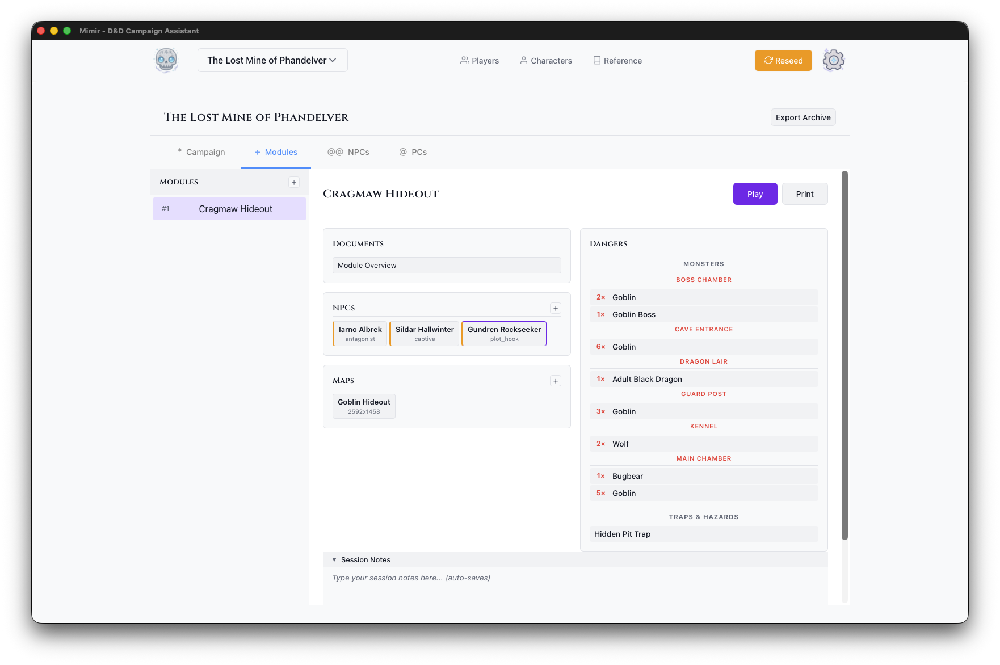

# Your First Module

This tutorial walks you through creating an adventure module in Mimir. By the end, you'll have a module with maps, monsters, and tokens ready for play.

**Time to complete:** 15-20 minutes

**What you'll learn:**
- Create a module within your campaign
- Upload and configure maps
- Add monsters from the D&D 5e catalog
- Place tokens on maps with the Token Setup tool
- Add light sources for dynamic lighting

## Prerequisites

- A campaign created and catalog data imported ([Tutorial 1](./01-first-campaign.md))
- A map file: a PNG/JPG image or a UVTT file — a universal VTT export format that embeds grid, wall, and lighting data (see [Map Formats](../explanation/map-formats.md)). You can export UVTT from Dungeondraft, download maps from free map sites, or build one with [Mimir's map generator](../how-to/maps/generate-map.md). **Use a UVTT map if you can** — to follow Tutorial 3's fog-of-war steps you'll need one (fog depends on UVTT wall data); a plain image works for everything else.

## What is a Module?

In Mimir, a **module** is a self-contained adventure within your campaign. Think of it as a chapter or episode - "The Goblin Hideout", "Dragon's Lair", or "The Haunted Manor". Each module has its own:

- Maps and encounters
- Monsters and traps
- NPCs
- Session notes and documents

This separation lets you prepare adventures independently and reuse them across campaigns.

## Step 1: Navigate to the Modules Tab

1. Open your campaign from the Campaign Selector
2. Click the **Modules** tab in the dashboard

You'll see the module sidebar (left) and the main panel (right).

## Step 2: Create a Module

1. Click the **+** button in the Modules section
2. In the Create Module dialog:
   - **Module Name** - Enter a descriptive name (e.g., "The Lost Mine - Cragmaw Hideout")
   - **Module Type** - Select the type (Standard Adventure, Mystery, Dungeon Crawl, Heist, Horror, Political Intrigue)
   - **Description** (optional) - Add notes about the module
3. Click **Create**

Your new module appears in the modules list.

## Step 3: Open the Module Dashboard

Click your new module in the modules list. The module dashboard opens in the main panel, with **Play**, **PDF**, and **Delete** buttons in its header and sections for documents, NPCs, maps, and dangers below.

## Step 4: Upload a Map

1. In the Maps section, click the **+** button
2. Choose your map file:
   - **Image files** (PNG, JPG, WebP) - Standard map images
   - **UVTT files** - Universal VTT format with embedded grid data

3. Enter a **Map Name** for the map

4. Click **Upload**

The map appears as a card in the Maps section, showing its name and pixel dimensions.

> **Tip:** UVTT files from tools like Dungeondraft include grid configuration automatically. For image files, you can [configure the grid](../how-to/maps/configure-grid.md) in Token Setup.

<!-- Screenshot: map-upload.png -->

## Step 5: Open Token Setup

The Token Setup modal is where you add monsters, place tokens, and configure your map.

1. Click your map's card in the Maps section
2. The Token Setup modal opens showing:
   - **Token Palette** (left) - Token types and monster search
   - **Map Canvas** (center) - The map with grid overlay
   - **Token Inventory** (right) - Placed tokens and light sources

The palette has more token types than we'll use here — see the [Token Setup Modal reference](../reference/ui/token-setup-modal.md) for all of them.

## Step 6: Add a Monster

This step searches the catalog, so it requires the source data you imported in [Tutorial 1](./01-first-campaign.md#step-7-import-catalog-data) ([Manage Campaign Sources](../how-to/campaigns/manage-sources.md)).

1. In the Token Palette, click **Monster**
2. Search for "Goblin"
3. Select **Goblin** from the search results
4. Click on the map to place the monster token

<!-- Screenshot: add-monsters.png -->

The goblin appears on the map and in the Token Inventory on the right. Repeat to place a second goblin if you like — drag tokens to reposition them, or click the **×** in the inventory to delete one.

## Step 7: Add a Light Source

A light source feeds Mimir's dynamic lighting — the engine that computes illuminated areas from lights and walls — and fog of war, which hides unexplored or unseen areas from players (see the [glossary](../reference/glossary.md)).

1. In the Token Palette, find the **Light Sources** section
2. Click **Torch**
3. Click on the map to place the torch

The torch appears in the Token Inventory under "Light Sources" with a **Lit/Unlit** toggle. It will illuminate the area around it in the DM Map window during play.

## Step 8: Save and Close

Token placements save automatically. Click **×** or press Escape to close the Token Setup modal.

Your module is now ready for play!

## What's Next?

Your module is prepared with maps, monsters, and tokens. Continue to:

1. **[Run your first session](./03-first-session.md)** - Use Play Mode to run an encounter
2. **Add more content** - Upload additional maps, add NPCs, create documents
3. **Prepare multiple modules** - Create the next chapter of your adventure

For full details on token placement, see [Place Tokens on a Map](../how-to/maps/place-tokens.md) and the [Token Setup Modal reference](../reference/ui/token-setup-modal.md).

---

*Next tutorial: [Running Your First Session](./03-first-session.md)*
