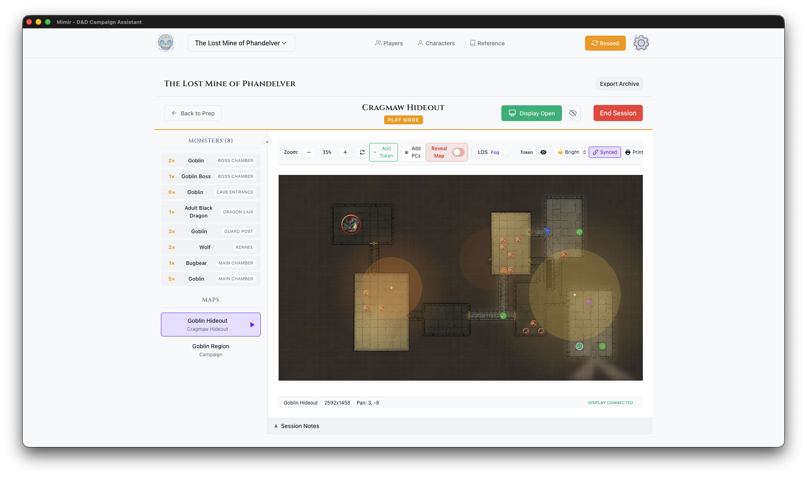
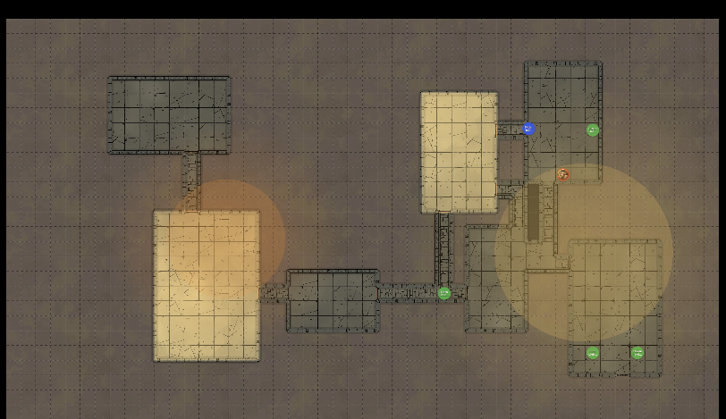

# Player Display Setup

This tutorial walks you through setting up and using the Player Display - a second window that shows your players what their characters can see while you maintain full DM control.

**Time to complete:** 5 minutes

**What you'll learn:**
- Set up a second screen for players
- Open and control the Player Display
- Understand what players see vs. what you see
- Use Blackout mode for dramatic reveals

## Prerequisites

- Completed [Tutorial 3](./03-first-session.md) (DM Map window basics)
- Ideally: a second monitor, TV, or projector for players

## The Two-Screen Setup

The Player Display creates a two-screen experience:

| Your Screen (DM) | Player Screen |
|------------------|---------------|
| Full map with all tokens | Fog of war applied |
| Monster names and stats | Token images only |
| Hidden tokens visible | Hidden tokens invisible |
| All controls and tools | Clean, focused view |

This lets you manage everything behind the scenes while players see only what their characters would see.

## Step 1: Connect Your Second Screen

Before opening the Player Display, connect your second screen:

- **TV or Monitor** - HDMI/DisplayPort connection
- **Projector** - For tabletop projection
- **Extended Display** - Not mirrored (each screen shows different content)

### Display Arrangement

On your computer:
1. Open display settings
2. Set to "Extend" (not "Mirror")
3. Arrange screens to match physical layout
4. Note which screen is secondary

## Step 2: Open the DM Map Window

1. Open your campaign
2. Go to the **Modules** tab
3. Select a module and click **Play** — the DM Map window opens
4. Make sure a map is selected in the **Map** dropdown at the top left of the window

## Step 3: Open the Player Display

In the DM Map window's toolbar:

1. Click the **Display** button
2. A new window opens
3. The button changes to show **Display On**

### Position the Window

Drag the Player Display window to your secondary screen:
1. Click and hold the window title bar
2. Drag to the player-facing screen
3. Maximize the window (or press F11 for fullscreen)

> **Tip:** On macOS, you can use Mission Control to move windows between spaces. On Windows, use Win+Shift+Arrow keys.

## Step 4: Understanding the Views

### What You See (DM View)

Your view shows everything:
- All tokens (visible and hidden)
- Token names and labels
- Full toolbar and controls
- Line of sight visualization (debug overlays)

### What Players See

The player display shows:
- The map image
- Fog of war based on PC positions
- Visible tokens only (no hidden enemies)
- Token images without names
- No controls or UI elements

## Step 5: Controlling What Players See

### Fog of War

With **Fog** enabled in the map toolbar (UVTT maps only — fog needs wall data), fog of war updates automatically based on:
- Where PC tokens are positioned
- Their vision radius (including darkvision)
- Active light sources
- Walls and obstacles

Move a PC token and watch the fog update in real-time on both screens.

### Reveal Map Toggle

For situations where you want to show the whole map:
1. Find the **Reveal Map** toggle in the toolbar
2. Enable it to bypass fog of war
3. Disable it to restore fog of war

Use this for:
- Area maps without exploration
- Post-combat wrap-up
- Location reveals

### Ambient Lighting

The ambient light level affects visibility:

| Level | Effect |
|-------|--------|
| Bright | Normal visibility, full colors |
| Dim | Reduced visibility, muted colors |
| Dark | Only darkvision and light sources work |

Change this to match the in-game environment (dungeon, night, etc.).

## Step 6: Using Blackout Mode

The **Blackout** button (a crossed-out-eye icon with the tooltip "Toggle Blackout") appears next to **Display On** in the DM Map window toolbar while the display is open:

1. Click **Blackout** to hide everything from players
2. The player screen blacks out and shows "Display Paused"
3. Click again to restore the view

Blackout is handy whenever you want to change something without the players watching — setup, map transitions, or a dramatic reveal.

## Step 7: Closing the Display

When your session ends:

1. Click the **Display On** button again, or
2. Close the player display window directly
3. The button returns to **Display**

The DM Map window stays open - you can reopen the display anytime.

## Setup Tips

For in-person play, position the TV, monitor, or projector so all players can see it, and adjust brightness for the room. For remote play, screen-share the Player Display window through your video call app.

If something isn't working, see [Troubleshooting](../reference/troubleshooting.md).

---

## Next Steps

You can now create campaigns, build modules with maps and encounters, run sessions with fog of war, and use a second screen for players. One tutorial remains: creating your own homebrew content.

---

*Next tutorial: [Creating Homebrew Content](./05-homebrew-content.md)*
